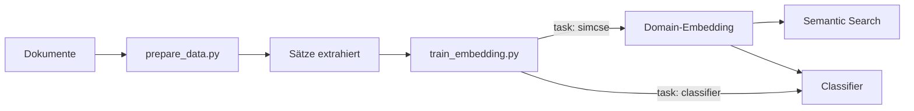

# Embedding Training

> Trainiere Embedding-Modelle auf deinen eigenen Texten — für Semantic Search,
> Domain-Adaptation oder Text-Klassifikation.

---

## Überblick



Zwei Skripte, zwei Tasks, ein Workflow.

---

## Quickstart

```bash
# 1. Abhängigkeiten
pip install sentence-transformers transformers torch numpy scikit-learn tqdm

# 2. Daten vorbereiten
python3 scripts/prepare_data.py

# 3. Embedding trainieren (SimCSE)
python3 scripts/train_embedding.py
```

---

## Scripts

### `prepare_data.py`

Liest `.md`-Dateien, entfernt Markdown-Syntax, YAML, Bilder.
Extrahiert Sätze (ein Satz pro Zeile).
Parameter oben: `INPUT_DIR`, `OUTPUT_SIMCSE`, `MIN_SENTENCE_LENGTH`.

### `train_embedding.py`

Ein Script, zwei Modi — gesteuert durch `CONFIG` ganz oben:

```python
CONFIG = {
    "model_name": "intfloat/multilingual-e5-small",
    "output_path": "models/mein_modell",
    "task": "simcse",                   # "simcse" oder "classifier"
    "data_path": "data/processed/sentences.txt",
    "data_delimiter": "\t",
    "batch_size": 16,
    "epochs": 3,
    "learning_rate": 2e-5,
    "max_seq_length": 128,
    "warmup_ratio": 0.1,
    "device": "auto",
}
```

**Task `simcse`** — Domain-Adaptation ohne Label.
Contrastive Learning: gleicher Satz, zweimal encoded, verschiedene Dropout-Masken.
→ Output: angepasstes Embedding-Modell

**Task `classifier`** — Klassifikation auf Embeddings.
Extrahiert Embeddings → LogisticRegression → speichert Classifier.
→ Output: `classifier.joblib`

**Parameter:**

| Parameter | Werte | Default | Erklärung |
|-----------|-------|---------|-----------|
| `model_name` | HuggingFace-ID | `intfloat/multilingual-e5-small` | Basis-Modell |
| `output_path` | Pfad | `models/mein_modell` | Speicherort |
| `task` | `"simcse"` / `"classifier"` | `simcse` | Trainingsart |
| `data_path` | Pfad | — | SimCSE: Satz/Zeile. Classifier: satz\\tlabel |
| `data_delimiter` | String | `\t` | Trennzeichen für Classifier |
| `batch_size` | 4–64 | `16` | Grösser = stabiler, mehr RAM |
| `epochs` | 1–10 | `3` | Mehr = stärkere Anpassung |
| `learning_rate` | 1e-6 – 5e-5 | `2e-5` | Schrittgrösse |
| `max_seq_length` | 64–512 | `128` | Token-Limit pro Satz |
| `warmup_ratio` | 0.0–0.5 | `0.1` | LR-Aufwärmphase |
| `device` | `"auto"`/`"mps"`/`"cpu"` | `auto` | MPS = Apple GPU |

### `translate.py`

Übersetzt tabellarische Daten mit HuggingFace-Modell.

```bash
python3 scripts/translate.py
```

Konfiguration oben: `INPUT_PATH`, `OUTPUT_PATH`, `TEXT_COLUMN`, `MODEL_NAME`.
Standard: `Helsinki-NLP/opus-mt-en-de` (EN→DE).

---

## Modell-Versionierung (Beispiel)

```
Basis-Modell
  ├── SimCSE(Domäne A)    →  V1 (Domain-Embedding)
  │                            └── Classifier(Labels A) → V1CA
  └── SimCSE(Domäne B)    →  V2
                                 └── Classifier(Labels B) → V2CB
```

Frei anpassbar. Jedes Projekt bekommt seine eigene Versionskette.

---

## Entscheidungsbaum

```
< 500 Sätze       → epochs: 5, batch_size: 8
> 1000 Sätze      → epochs: 3, batch_size: 16

Apple Silicon     → device: "auto" (MPS)
Wenig RAM         → device: "cpu", batch_size: 8

Leichte Anpassung  → epochs: 1-2, learning_rate: 1e-5
Starke Anpassung   → epochs: 3-5, learning_rate: 2e-5
```

---

## Modell verwenden

```python
from sentence_transformers import SentenceTransformer
import joblib

# Embedding
model = SentenceTransformer("models/mein_modell")
vec = model.encode("Ein beliebiger Satz.")

# Classifier
clf = joblib.load("models/mein_modell/classifier.joblib")
pred = clf.predict([vec])[0]
```

---

## Unterstützte Modelle

| HuggingFace ID | Parameter | Dim | RAM |
|----------------|-----------|-----|-----|
| `intfloat/multilingual-e5-small` | 118 M | 384 | ~450 MB |
| `intfloat/multilingual-e5-base` | 278 M | 768 | ~1.1 GB |
| `jinaai/jina-embeddings-v2-base-de` | 137 M | 768 | ~500 MB |
| `paraphrase-multilingual-MiniLM-L12-v2` | 117 M | 384 | ~420 MB |

---

## Projekt-Struktur

```
trainebmbedding/
├── scripts/
│   ├── prepare_data.py       .md → Sätze
│   ├── train_embedding.py    SimCSE + Classifier
│   └── translate.py          Übersetzung (optional)
├── docs/
│   ├── lehrbuch.md           Vollständige Dokumentation
│   ├── modelle_vergleich.md  Modell-Vergleich
│   └── test_pairs.md         Validierungs-Paare (Vorlage)
├── modules/
├── data/                     Rohdaten (ignoriert)
├── models/                   Modelle (ignoriert)
└── logs/                     Logs (ignoriert)
```

---

## Lizenz

MIT — siehe `LICENSE`.
