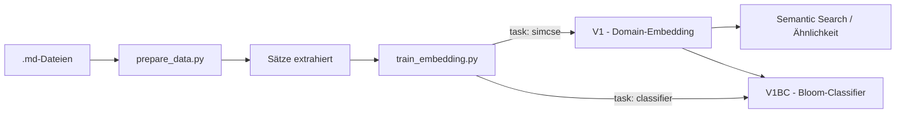

# Embedding Training

> Trainiere Embedding-Modelle auf deinen eigenen Texten — für Semantic Search,
> Domain-Adaptation oder Text-Klassifikation (z.B. Bloom's Taxonomie).

---

## Überblick



Zwei Skripte, zwei Tasks, ein Workflow.

---

## Quickstart

```bash
# 1. Abhängigkeiten
pip install sentence-transformers transformers torch numpy scikit-learn tqdm

# 2. Daten vorbereiten
python3 scripts/prepare_data.py

# 3. Embedding trainieren (SimCSE)
python3 scripts/train_embedding.py
```

Fertig. Das trainierte Modell liegt unter `models/V1`.

---

## Scripts

### `prepare_data.py`

Liest `.md`-Dateien aus `data/knowledge/raw/`, entfernt Markdown-Syntax,
YAML-Frontmatter, Bilder. Extrahiert Sätze nach `data/knowledge/processed/sentences.txt`.

**Parameter** (oben im Script): `INPUT_DIR`, `OUTPUT_SIMCSE`, `MIN_SENTENCE_LENGTH`, `MAX_SENTENCE_LENGTH`

### `train_embedding.py`

Ein Script, zwei Modi — gesteuert durch `CONFIG` ganz oben:

```python
CONFIG = {
    "model_name": "intfloat/multilingual-e5-small",   # HuggingFace-ID
    "output_path": "models/V1",                       # Speicherort
    "task": "simcse",                                 # "simcse" oder "classifier"
    "data_path": "data/knowledge/processed/sentences.txt",
    "data_delimiter": "\t",
    "batch_size": 16,
    "epochs": 3,
    "learning_rate": 2e-5,
    "max_seq_length": 128,
    "warmup_ratio": 0.1,
    "device": "auto",                                 # "auto", "mps", "cpu"
}
```

**Task `simcse`** — Domain-Adaptation ohne Label.
Jeder Satz wird zweimal encoded (unterschiedliches Dropout). Contrastive Loss
zieht die beiden Vektoren zusammen und schiebt andere Sätze auseinander.
→ Output: angepasstes Embedding-Modell (V1)

**Task `classifier`** — Klassifikation auf Embeddings.
Extrahiert Embeddings, trainiert LogisticRegression darauf, speichert Classifier.
→ Output: `models/V1BC/classifier.joblib`

**Parameter-Referente (Details):**

| Parameter | Werte | Default | Erklärung |
|-----------|-------|---------|-----------|
| `model_name` | HuggingFace-ID | `intfloat/multilingual-e5-small` | Basis-Modell. Austauschbar. |
| `output_path` | Pfad | `models/V1` | Speicherort |
| `task` | `"simcse"` / `"classifier"` | `simcse` | Trainingsart |
| `data_path` | Pfad | `data/knowledge/processed/sentences.txt` | SimCSE: Satz pro Zeile. Classifier: satz\\tlabel |
| `data_delimiter` | String | `\t` | Trennzeichen für Classifier |
| `batch_size` | 4–64 | `16` | Grösser = stabiler, mehr RAM |
| `epochs` | 1–10 | `3` | Mehr = stärkere Anpassung |
| `learning_rate` | 1e-6 – 5e-5 | `2e-5` | Schrittgrösse |
| `max_seq_length` | 64–512 | `128` | Token-Limit pro Satz |
| `warmup_ratio` | 0.0–0.5 | `0.1` | Aufwärmphase der LR |
| `device` | `"auto"`/`"mps"`/`"cpu"` | `auto` | MPS = Apple GPU |

### `translate_bloom.py`

Englischen Bloom-Datensatz → Deutsch. Nutzt `Helsinki-NLP/opus-mt-en-de`.

```bash
python3 scripts/translate_bloom.py
```

Output: `data/blooms/translated/de_bloom_bilingual.csv` + `data/blooms/processed/bloom_for_classifier.txt`

---

## Modell-Versionierung

```
V1:   e5-small + SimCSE(Vault-Daten)        → Domain-Embedding
V1BC: V1 + Classifier(Bloom-Daten)          → Bloom-Klassifikation

V2:   [anderes Modell] + SimCSE(neue Daten)
V2XY: V2 + Classifier(andere Labels)
```

**Bloom-Stufen:**
| Label | Stufe | Beispiel |
|-------|-------|----------|
| 0 | Erinnern | "Die Schüler nennen die fünf Sinne." |
| 1 | Verstehen | "Die Schüler erklären den Treibhauseffekt." |
| 2 | Anwenden | "Die Schüler berechnen den Luftwiderstand." |
| 3 | Analysieren | "Die Schüler vergleichen Demokratie und Diktatur." |
| 4 | Bewerten | "Die Schüler beurteilen die Ethik der Gentechnik." |
| 5 | Erschaffen | "Die Schüler entwerfen ein eigenes Experiment." |

---

## Unterstützte Modelle

| HuggingFace ID | Parameter | Dim | RAM | Bemerkung |
|----------------|-----------|-----|-----|-----------|
| `intfloat/multilingual-e5-small` | 118 M | 384 | ~450 MB | ✅ Default |
| `intfloat/multilingual-e5-base` | 278 M | 768 | ~1.1 GB | Höhere Qualität |
| `jinaai/jina-embeddings-v2-base-de` | 137 M | 768 | ~500 MB | Deutsch, 8192 Token |
| `paraphrase-multilingual-MiniLM-L12-v2` | 117 M | 384 | ~420 MB | Sehr stabil |

Einfach `model_name` in der CONFIG austauschen.

---

## Entscheidungsbaum

```
Wenig Daten (< 500 Sätze)    → epochs: 5, batch_size: 8
Viel Daten (> 1000 Sätze)    → epochs: 3, batch_size: 16

Apple Silicon                → device: "auto" (MPS)
Wenig RAM / älterer Mac      → device: "cpu", batch_size: 8

Leichte Anpassung            → epochs: 1-2, learning_rate: 1e-5
Starke Domain-Adaptation     → epochs: 3-5, learning_rate: 2e-5
```

---

## Modell verwenden

```python
from sentence_transformers import SentenceTransformer
import joblib

# V1 laden (Embedding)
model = SentenceTransformer("models/V1")
vec = model.encode("Die Kalotte ist die tragende Hülle.")
# → np.array, 384 Werte

# V1BC laden (Bloom-Klassifikation)
clf = joblib.load("models/V1BC/classifier.joblib")
text = "Die Schüler erklären die Funktion der Mitochondrien."
embedding = model.encode(text)
level = clf.predict([embedding])[0]  # → 1 (Verstehen)
```

---

## Projekt-Struktur

```
trainebmbedding/
├── scripts/
│   ├── prepare_data.py           .md → Sätze
│   ├── train_embedding.py        SimCSE + Classifier (CONFIG oben)
│   └── translate_bloom.py        EN → DE Übersetzung
├── docs/
│   ├── lehrbuch.md               Vollständige Dokumentation
│   ├── modelle_vergleich.md      Modell-Vergleich
│   └── test_pairs.md             40 Validierungs-Paare
├── modules/                      Für später
├── data/                         Rohdaten (ignoriert in git)
├── models/                       Trainierte Modelle (ignoriert)
└── logs/                         Trainings-Logs (ignoriert)
```

---

## Lizenz

MIT — mach damit was du willst.
