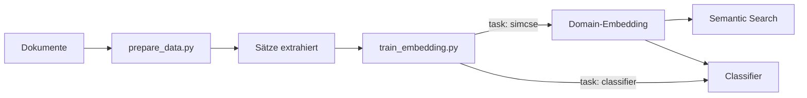

# Embedding Training

> Trainiere Embedding-Modelle auf deinen eigenen Texten — für Semantic Search,
> Domain-Adaptation oder Text-Klassifikation.

---

## Überblick



Zwei Skripte, zwei Tasks, ein Workflow.

---

## Quickstart

```bash
# 1. Abhängigkeiten
pip install sentence-transformers transformers torch numpy scikit-learn tqdm

# 2. Daten vorbereiten
python3 scripts/prepare_data.py

# 3. Embedding trainieren (SimCSE)
python3 scripts/train_embedding.py
```

---

## Scripts

### `prepare_data.py`

Liest `.md`-Dateien, entfernt Markdown-Syntax, YAML, Bilder.
Extrahiert Sätze (ein Satz pro Zeile).
Parameter oben: `INPUT_DIR`, `OUTPUT_SIMCSE`, `MIN_SENTENCE_LENGTH`.

### `train_embedding.py`

Ein Script, zwei Modi — gesteuert durch `CONFIG` ganz oben:

```python
CONFIG = {
    "model_name": "intfloat/multilingual-e5-small",
    "output_path": "models/V2",
    "task": "simcse",                   # "simcse" oder "classifier"
    "data_path": "data/knowledge/processed/sentences.txt",
    "data_delimiter": "\t",
    "batch_size": 64,
    "epochs": 1,
    "learning_rate": 2e-5,
    "weight_decay": 0.01,
    "warmup_ratio": 0.1,
    "max_seq_length": 128,
    "contrastive_scale": 10,
    "classifier_method": "mlp",         # "mlp", "logistic", "rf"
    "device": "cpu",
}
```

**Task `simcse`** — Domain-Adaptation ohne Label.
Contrastive Learning: gleicher Satz, zweimal encoded, verschiedene Dropout-Masken.
→ Output: angepasstes Embedding-Modell

**Task `classifier`** — Klassifikation auf Embeddings (schnell, ~50% Genauigkeit).
Extrahiert Embeddings → MLP/LogisticRegression → speichert Classifier.
→ Output: `classifier.joblib`

**Parameter:**

| Parameter | Werte | Default | Erklärung |
|-----------|-------|---------|-----------|
| `model_name` | HuggingFace-ID | `intfloat/multilingual-e5-small` | Basis-Modell |
| `output_path` | Pfad | `models/mein_modell` | Speicherort |
| `task` | `"simcse"` / `"classifier"` | `simcse` | Trainingsart |
| `data_path` | Pfad | — | SimCSE: Satz/Zeile. Classifier: satz\\tlabel |
| `data_delimiter` | String | `\t` | Trennzeichen für Classifier |
| `batch_size` | 4–128 | `32` | Grösser = mehr Negative (simcse) |
| `epochs` | 1–3 | `1` | SimCSE: 1 reicht |
| `learning_rate` | 1e-6 – 5e-5 | `2e-5` | Schrittgrösse |
| `weight_decay` | 0.0–0.1 | `0.01` | Verhindert Overfitting |
| `warmup_ratio` | 0.0–0.5 | `0.1` | LR-Aufwärmphase |
| `max_seq_length` | 64–512 | `128` | Token-Limit pro Satz |
| `contrastive_scale` | 1.0–50.0 | `10` | Schärfe des Contrastive Loss |
| `classifier_method` | `"mlp"`/`"logistic"`/`"rf"` | `"mlp"` | Classifier-Typ |
| `device` | `"auto"`/`"mps"`/`"cpu"` | `auto` | MPS = Apple GPU |

### `translate.py`

Übersetzt tabellarische Daten mit HuggingFace-Modell.

```bash
python3 scripts/translate.py
```

Konfiguration oben: `INPUT_PATH`, `OUTPUT_PATH`, `TEXT_COLUMN`, `MODEL_NAME`.
Standard: `Helsinki-NLP/opus-mt-en-de` (EN→DE).

### `text_classifier.py`

End-to-End Text-Klassifikation per BERT-Fine-Tuning.
Lokal, einfach, genau. Alle Hyperparameter werden oben im Script via
`CONFIG` gesetzt (keine CLI-Flags).

```bash
# Trainieren
python3 scripts/text_classifier.py --train

# Vorhersage (einzelner Satz)
python3 scripts/text_classifier.py --predict "Dein Text hier"

# Vorhersage (interaktiv — ein Satz pro Zeile, Enter = predict)
python3 scripts/text_classifier.py --predict
```

**Modus `--train`:**
Lädt Daten aus `CONFIG["data_path"]` (Format: `text\tlabel`), splittet
80/20, fine-tuned das Modell. Nach jeder Epoche Evaluation auf dem
Val-Split. Early Stopping bricht ab, wenn `early_stopping_patience`
Epochen keine Accuracy-Verbesserung bringen. Speichert das beste Modell
unter `output_path`. Ausgabe am Ende: Accuracy, F1 (macro) und
per-Class-Report.

**Modus `--predict`:**
Lädt das trainierte Modell von `output_path`. Tokenisiert den Eingabe-
Text, führt einen Forward-Pass aus und zeigt:
- **Vorhergesagte Klasse** mit Confidence (Softmax-Wahrscheinlichkeit)
- **Balkendiagramm** aller Klassen-Wahrscheinlichkeiten (z. B.
  `Erinnern  75% ███████████████  ←`)

Im **interaktiven Modus** (`--predict` ohne Text) können beliebig viele
Sätze nacheinander klassifiziert werden — eine Zeile = ein Satz.

**Parameter (CONFIG):**

| Parameter | Werte | Default | Erklärung |
|-----------|-------|---------|-----------|
| `data_path` | Pfad | `data/blooms/translated/de_bloom_classifier.txt` | Trainingsdaten (Text`\t`Label) |
| `data_delimiter` | String | `\t` | Trennzeichen zwischen Text und Label |
| `model_name` | HuggingFace-ID | `xlm-roberta-base` | Basis-Modell |
| `output_path` | Pfad | `models/text_classifier` | Speicherort für Modell + Tokenizer |
| `num_labels` | 2–10 | `6` | Anzahl Klassen |
| `epochs` | 1–10 | `10` | Maximale Epochen; → HuggingFace `num_train_epochs` |
| `batch_size` | 4–64 | `16` | Batch-Grösse |
| `learning_rate` | 1e-6 – 5e-5 | `2e-5` | Lernrate |
| `max_seq_length` | 64–512 | `128` | Token-Limit pro Satz |
| `weight_decay` | 0.0–0.1 | `0.01` | L2-Regularisierung gegen Overfitting |
| `early_stopping_patience` | 1–5 | `2` | Epochen ohne Verbesserung → Abbruch |
| `label_names` | [String] | Bloom-Stufen | Für Predict-Ausgabe (nur Anzeige) |
| `device` | `auto`/`mps`/`cpu` | `cpu` | CPU ist stabiler bei langem Training |

| Ansatz | Genauigkeit | Geschwindigkeit | Script |
|--------|-------------|-----------------|--------|
| Embedding + MLP | ~52% | ⚡ Sekunden | `train_embedding.py` |
| End-to-End BERT | **~75%** | 🐢 Minuten | `text_classifier.py` |

---

## Modell-Versionierung (Beispiel)

## Modell-Versionierung (Beispiel)

```
Basis-Modell
  ├── SimCSE(Domäne A)    →  V1 (Domain-Embedding)
  │                            └── Classifier(Labels A) → V1CA
  └── SimCSE(Domäne B)    →  V2
                                 └── Classifier(Labels B) → V2CB
```

Frei anpassbar. Jedes Projekt bekommt seine eigene Versionskette.

---

## Entscheidungsbaum

```
< 500 Sätze       → epochs: 5, batch_size: 8
> 1000 Sätze      → epochs: 3, batch_size: 16

Apple Silicon     → device: "auto" (MPS)
Wenig RAM         → device: "cpu", batch_size: 8

Leichte Anpassung  → epochs: 1-2, learning_rate: 1e-5
Starke Anpassung   → epochs: 3-5, learning_rate: 2e-5
```

---

## Modell verwenden

```python
from sentence_transformers import SentenceTransformer
import joblib

# Embedding
model = SentenceTransformer("models/mein_modell")
vec = model.encode("Ein beliebiger Satz.")

# Classifier
clf = joblib.load("models/mein_modell/classifier.joblib")
pred = clf.predict([vec])[0]
```

---

## Unterstützte Modelle

| HuggingFace ID | Parameter | Dim | RAM |
|----------------|-----------|-----|-----|
| `intfloat/multilingual-e5-small` | 118 M | 384 | ~450 MB |
| `intfloat/multilingual-e5-base` | 278 M | 768 | ~1.1 GB |
| `jinaai/jina-embeddings-v2-base-de` | 137 M | 768 | ~500 MB |
| `paraphrase-multilingual-MiniLM-L12-v2` | 117 M | 384 | ~420 MB |

---

## Monitoring

### Terminal (während des Trainings)

```bash
tail -f logs/train_*.log
```

**SimCSE-Log:**

```
Epoch 1, Batch 100/2365: Loss=0.0421 | 19.2 Bat/s | ETA: 14:52
Epoch 1, Batch 200/2365: Loss=0.0312 | 19.5 Bat/s | ETA: 14:52
Epoch 1 abgeschlossen: Avg Loss = 0.0412
Epoch 2 abgeschlossen: Avg Loss = 0.0083
Epoch 3 abgeschlossen: Avg Loss = 0.0047
Modell gespeichert: models/mein_modell
```

tqdm im Terminal zeigt live:
```
Epoch 1/3:  12%|██▌       | 284/2365 [00:15<01:48, 19.2batch/s]
```

**Classifier-Log:**

```
Cross-Validation Accuracy: 0.723 (+/- 0.031)
```

### Interpretation

| Beobachtung | Bedeutung |
|-------------|-----------|
| Loss sinkt epochal | ✅ Modell lernt |
| Loss = 0.0000 | ❌ Overfitting (SimCSE) |
| Accuracy > 0.7 | ✅ Brauchbar |
| Accuracy > 0.85 | ✅ Sehr gut |

---

## Projekt-Struktur

```
trainebmbedding/
├── scripts/
│   ├── prepare_data.py       .md → Sätze
│   ├── train_embedding.py    SimCSE + Classifier
│   └── translate.py          Übersetzung (optional)
├── docs/
│   ├── lehrbuch.md           Vollständige Dokumentation
│   ├── modelle_vergleich.md  Modell-Vergleich
│   └── test_pairs.md         Validierungs-Paare (Vorlage)
├── modules/
├── data/                     Rohdaten (ignoriert)
├── models/                   Modelle (ignoriert)
└── logs/                     Logs (ignoriert)
```

---

## Lizenz

MIT — siehe `LICENSE`.
